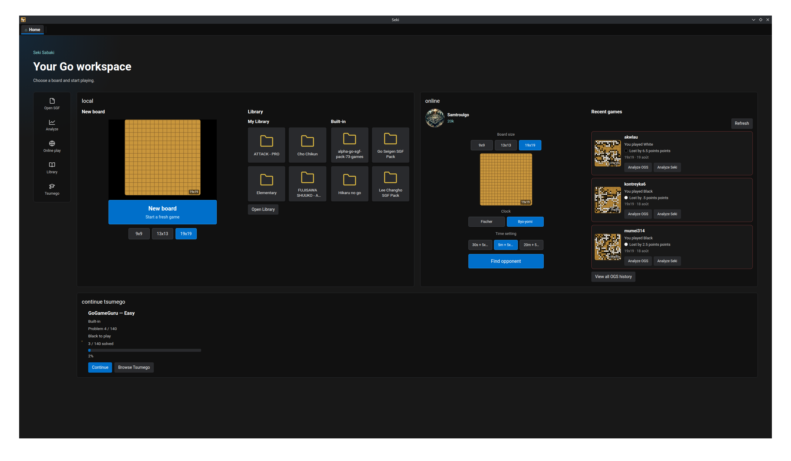
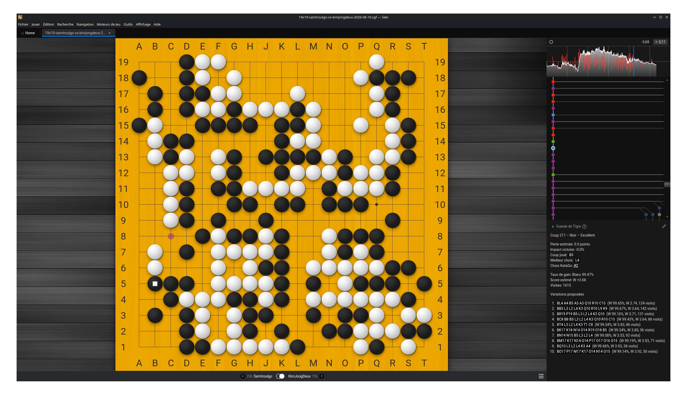
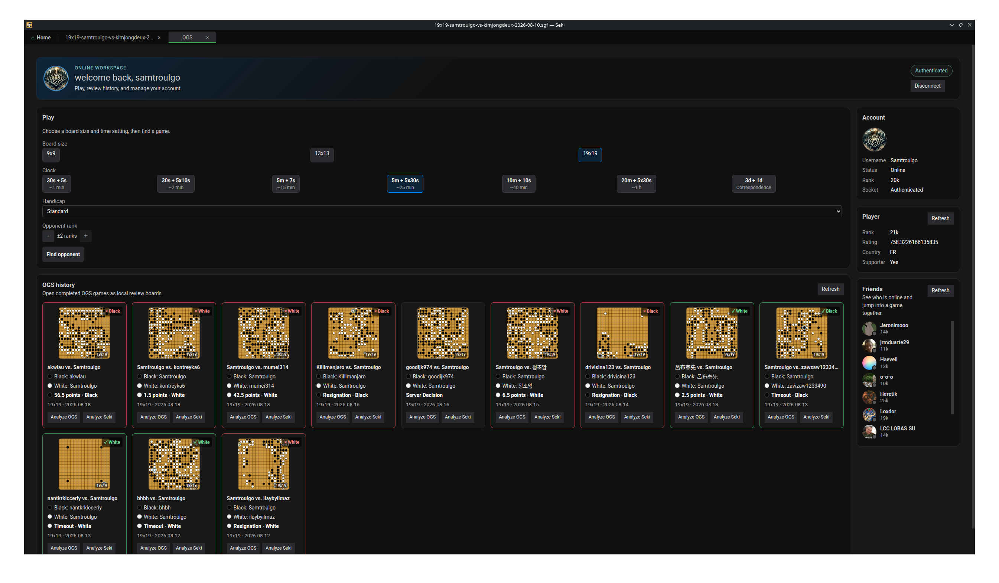
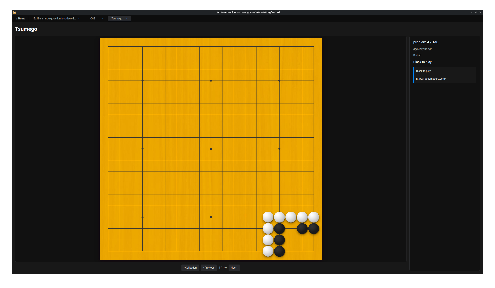

# Seki

**A desktop Go/Baduk workspace for playing, editing, analyzing, and studying
games.**

Seki combines a full local board and SGF editor with OGS online play, post-game
analysis, a game library, and dedicated tsumego tools.



## Features

- Local Go board and SGF editing, with GTP engine integration and board
  analysis.
- OGS online play, matchmaking, game history, and reviews.
- Post-game SGF analysis with KataGo.
- Library for browsing and reopening local games.
- Tsumego browser, solver, and creator.







## Project status

Seki is currently in alpha. The first functional milestone is complete, but
packaging and release distribution are still being hardened.

Stable downloads are not advertised here yet. For development and testing, Seki
can be run from source.

### Platform availability

- Windows: public prebuilt releases are available.
- Linux: public AppImage releases are available.
- Flatpak: beta.
- macOS: experimental and build-from-source for now; no official prebuilt macOS
  release is currently provided. Restoring signed and notarized public macOS
  builds is a funding-dependent goal; see [Support Seki](#support-seki).

## Support Seki

Seki is free and open source, and donations are entirely optional. Supporting
the project does not unlock features or provide a different version of Seki.

If you'd like to help with ongoing project costs, you can
[support Seki on Ko-fi](https://ko-fi.com/samda).

The first concrete funding goal is to make official macOS distribution practical
again. Properly signed and notarized macOS releases require Apple Developer
Program membership, which costs about US$100 per year. If community support can
cover that recurring cost, official macOS builds can be reconsidered.

## Development

Seki currently uses Node.js 24.

```bash
git clone https://github.com/Samtroulcode/Seki-Sabaki.git
cd Seki-Sabaki
npm install
npm start
```

Run the test suite:

```bash
npm test
```

Create a local build:

```bash
npm run build
```

## Origins

Seki is based on [Sabaki](https://github.com/SabakiHQ/Sabaki), the open-source
Go board and SGF editor originally created by Yichuan Shen and developed by its
contributors.

## License

Seki is distributed under the [MIT License](LICENSE.md). Existing upstream
copyright and license notices are retained where required.
